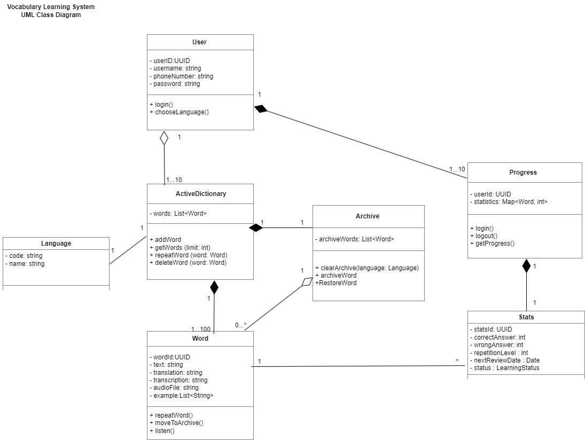
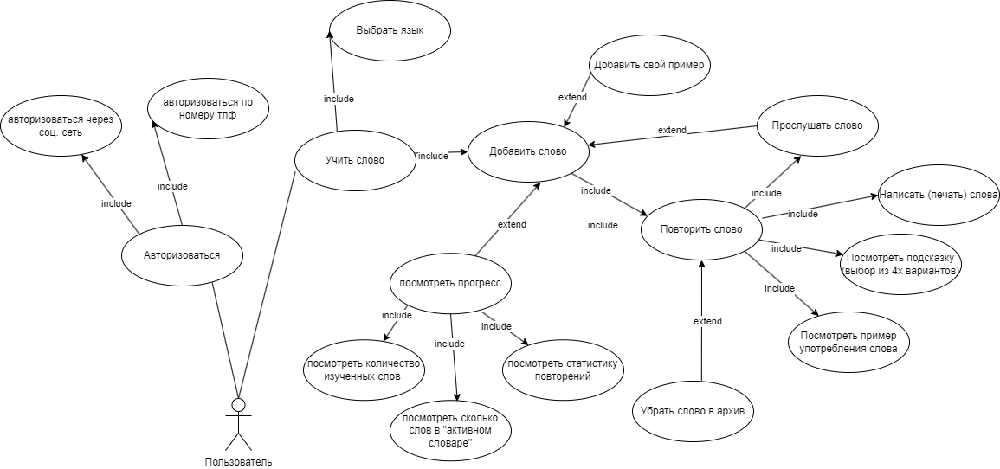

# Учу слово/Vocabulary Learning System 

## Описание проекта
Система предназначена для изучения иностранных слов учениками языковой школы.
Пользователь добавляет слова в активный словарь, повторяет их и отслеживает прогресс обучения.
Выученные слова могут быть перенесены в архив.

## Основные функции
- выбор и изменение языка обучения
- получение списка доступных языков
- добавление слов в активный словарь
- получение перевода слова
- интервальное повторение слов
- перенос слов в архив
- очистка архива

## Диаграммы

### Диаграмма классов
 
Редактируемый исходник: [class-diagram.drawio](UML/class-diagram.drawio)

### Диаграмма вариантов использования
  
Редактируемый исходник: [use-case.drawio](UML/use-case.drawio)

## API (Swagger)

API системы описан с использованием стандарта OpenAPI 3.0.

- [Swagger UI](https://app.swaggerhub.com/apis-docs/MILAMIHEEVA/LearningWord/1.0.0)
- [OpenAPI спецификация](swagger/uchu-slovo.yaml)

### Основные эндпоинты

**Языки**
- `GET /Language` — получить текущий язык
- `PUT /Language/{code}` — изменить язык
- `GET /Languages` — получить список языков

**Словари**
- `GET /ActiveDictionary` — получить список изучаемых слов
- `GET /ActiveDictionary/word` — получить перевод слова
- `POST /ActiveDictionary/word` — добавить слово
- `PATCH /ActiveDictionary/word` — перенести слово в архив

**Архив**
- `DELETE /Archive` — очистить архив

## Документы

- [specification.md](specification.md) — просмотр на GitHub   
- [specification.docx](specification.docx) — скачать исходный документ

## Структура проекта

- README.md
- specification.md / specification.docx
- UML/
  - class-diagram.png
  - class-diagram.drawio
  - use-case-diagram.png
  - use-case-diagram.drawio
- Swagger/
  - uchu-slovo.yaml

## Учебные диаграммы бизнес-процессов

В папке `BPMN-IDF0-examples/` находятся учебные диаграммы, не связанные напрямую с проектом "Учу слово".

### Верхнеуровневая диаграмма IDEF0 (A0)
  
Описание: оформление туристической путёвки.  
- **Входы:** запрос клиента, предложения туроператоров  
- **Выход:** путёвка  
- **Управление:** договор услуг, правила визового режима, условия страхования  
- **Механизмы:** туроператор, система бронирования, отдел продаж  

### Диаграмма BPMN
  
Описание: включает пулы **Клиент** и **Система**, подпроцесс регистрации пользователя и ключевые шаги от ввода данных до подтверждения бронирования.

Файлы исходников Draw.io также находятся в папке `BPMN-IDF0-examples/`.

## Примечание

Swagger API представляет упрощённую модель взаимодействия с системой и может не полностью отражать внутреннюю структуру классов, представленную на UML-диаграмме.